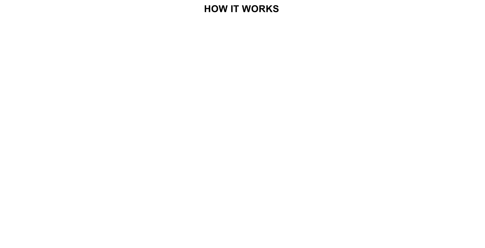
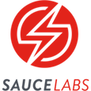

<p align="center">
  
</p>

[](https://travis-ci.org/zalando/zalenium)
[](https://www.codacy.com/app/diemol_zalenium/zalenium?utm_source=github.com&amp;utm_medium=referral&amp;utm_content=zalando/zalenium&amp;utm_campaign=Badge_Grade)
[](https://codecov.io/gh/zalando/zalenium)
[]()
[](https://hub.docker.com/r/dosel/zalenium/tags/)
[](https://gitter.im/zalando/zalenium?utm_source=badge&utm_medium=badge&utm_campaign=pr-badge)


# Zalenium
This is a Selenium Grid extension to scale your local grid dynamically with docker containers. It uses
[docker-selenium](https://github.com/elgalu/docker-selenium) to run your tests in Firefox and Chrome locally, if you
need a different browser, your tests can get redirected to a cloud testing provider ([Sauce Labs](https://saucelabs.com/), 
[BrowserStack](https://www.browserstack.com/), [TestingBot](https://testingbot.com/)). Zalenium has also support for 
[Kubernetes](./docs/k8s/kubernetes.md).

Zalenium's maintainers add new features regularly. We invite you to test it, report bugs, suggest any ideas you may
have, and contribute. See our [contributing guidelines](CONTRIBUTING.md) for more details.

### Why?

> Thanks for open sourcing this. Our test suite run time has dropped from more than an hour to six minutes. — [@TKueck](https://twitter.com/Tkueck/status/887425829273088000)

We know how complicated it is to:
* Have a stable grid to run UI tests with Selenium
* Maintain it over time (keep up with new browser, Selenium and drivers versions)
* Provide capabilities to cover all browsers and platforms

That is why we took this approach where [docker-selenium](https://github.com/elgalu/docker-selenium) nodes are
created on demand. Your UI tests in Firefox and Chrome will run faster because they are running on a local grid,
on a node created from scratch and disposed after the test completes.

If you need a capability that cannot be fulfilled by [docker-selenium](https://github.com/elgalu/docker-selenium),
the test gets redirected to a cloud testing provider ([Sauce Labs](https://saucelabs.com/),
[BrowserStack](https://www.browserstack.com/), [TestingBot](https://testingbot.com/)).

Zalenium's main goal is: to allow anyone to have a disposable and flexible Selenium Grid infrastructure.

Part of the idea comes from this [Sauce Labs post](https://saucelabs.com/blog/introducing-the-sauce-plugin-for-selenium-grid).

### What does **Zalenium** mean?
As you can imagine, it is the result of mixing _[Zalando](https://tech.zalando.com)_ and _[Selenium](http://www.seleniumhq.org/)_.
As mentioned before, this project's aim is to provide a simple way to create a grid and contribute to the Selenium community.
Nevertheless, this is _**not**_ an official [Selenium](http://www.seleniumhq.org/) project. We kindly ask you to post
[issues](https://github.com/zalando/zalenium/issues/new) or [questions](https://gitter.im/zalando/zalenium) through the
channels we created for that.

***

## Contents

* [Getting Started](#getting-started)
  * [Prerequisites](#prerequisites)
  * [Set it up](#set-it-up)
  * [Run it](#run-it)
* [Additional features](#additional-features)
* [Docker version](#docker-version)
  * [Linux](#linux)
  * [OSX](#osx)
* [Kubernetes version](./docs/k8s/kubernetes.md)
* [Contributions](#contributions)
  * [Building and Testing](#building-and-testing)
* [How it works](#how-it-works)
* [About the project versioning](#about-the-project-versioning)
* [Usage examples](./docs/usage_examples.md)
* [Performance](./docs/performance.md)

## Getting Started

#### Prerequisites
* Docker engine running, version >= 1.11.1 (probably works with earlier versions, not tested yet).
* Pull the [docker-selenium](https://github.com/elgalu/docker-selenium) image. `docker pull elgalu/selenium`
* If you want to use the cloud testing provider integration feature ([Sauce Labs](https://saucelabs.com/),
[BrowserStack](https://www.browserstack.com/), [TestingBot](https://testingbot.com/)), you will need an account with them.

#### Set it up
* Make sure your docker daemon is running (e.g. `docker info` works without errors).
* `docker pull dosel/zalenium`

#### Run it
Zalenium uses docker to scale on-demand, therefore we need to give it the `docker.sock` full access, this is known as
"Docker alongside docker".

* Basic usage, without any of the integrated cloud testing platforms enabled:

  ```sh
    docker run --rm -ti --name zalenium -p 4444:4444 \
      -v /var/run/docker.sock:/var/run/docker.sock \
      -v /tmp/videos:/home/seluser/videos \
      --privileged dosel/zalenium start
  ```

  * Why `--privileged`? We suggest you run Zalenium as `--privileged` to speed up the node registration process by
      increasing the entropy level with [Haveged](http://www.issihosts.com/haveged/). Using `--privileged` is optional
      since it is just meant to improve its performance. For more information, check this
      [tutorial](https://www.digitalocean.com/community/tutorials/how-to-setup-additional-entropy-for-cloud-servers-using-haveged).

* You can also try our one line installer and starter (it will check for the latest images and ask for missing
dependencies.)

  ```sh
    curl -sSL https://raw.githubusercontent.com/dosel/t/i/p | bash -s start
  ```

* More usage examples, more parameters, configurations, video usage and one line starters can be seen [here](./docs/usage_examples.md)
* After the output, you should see the DockerSeleniumStarter node in the [grid](http://localhost:4444/grid/console)
* Now you can point your Selenium tests to [http://localhost:4444/wd/hub](http://localhost:4444/wd/hub)
* Stop it: `docker stop zalenium`

## Additional features
* [Dashboard](http://localhost:4444/dashboard), see all the videos and aggregated logs after your tests completed. 
Check a live demo [here](http://zalenium.bitballoon.com/dashboard)
  <p align="center">
    
  </p>
* Live preview of your running tests [http://localhost:4444/grid/admin/live](http://localhost:4444/grid/admin/live)
<p align="center">
  
</p>

* Video recording, check them in the `/tmp/videos` folder (or the one you mapped when starting Zalenium)
* Customise video file naming via capabilities and [more](./docs/usage_examples.md)
* Basic auth to protect the grid when deployed to the open internet, instructions to enable basic auth [here](./docs/usage_examples.md#enabling-basic-auth-in-zalenium)

## Docker version

#### Linux
For Linux systems you can simply share the docker binary via `-v $(which docker):/usr/bin/docker`

```sh
docker run --rm -ti --name zalenium -p 4444:4444 \
  -v $(which docker):/usr/bin/docker \
  -v /var/run/docker.sock:/var/run/docker.sock \
  -v /tmp/videos:/home/seluser/videos \
  --privileged dosel/zalenium start
```

#### OSX
Zalenium for OSX is currently compatible with Docker `17.03.1-ce`, `17.06.2-ce`, and `17.09.0-ce`. Nevertheless, starting
with 1.13, newer CLIs can talk to older daemons. If you bump into any API compatibility issues, you can explicitly tell
Zalenium which version you are using via `-e DOCKER=17.06.2-ce`.

```sh
docker run --rm -ti --name zalenium -p 4444:4444 \
  -e DOCKER=17.06.2-ce \
  -v /var/run/docker.sock:/var/run/docker.sock \
  -v /tmp/videos:/home/seluser/videos \
  --privileged dosel/zalenium start
```

### Windows 

```sh
docker run --rm -ti --name zalenium -p 4444:4444 \
  -v /var/run/docker.sock:/var/run/docker.sock \
  -v /c/Users/your_user_name/temp/videos:/home/seluser/videos \
  --privileged dosel/zalenium start      
```

## Contributions
Any feedback or contributions are welcome! Please check our [guidelines](CONTRIBUTING.md), they just follow the general
GitHub issue/PR flow. 

Also, we have adopted the Contributor Covenant as the code of conduct for this project:

http://contributor-covenant.org/version/1/4/

#### Building and Testing

If you want to verify your changes locally with the existing tests (please double check that the Docker daemon is
running and that you can do `docker ps`):
* Unit tests

    ```sh
        mvn clean test
    ```
* Building the image

    ```sh
        mvn clean package
        cd target
        docker build -t zalenium:YOUR_TAG .
    ```
* Running the image you just built
    ```sh
      docker run --rm -ti --name zalenium -p 4444:4444 \
        -v /var/run/docker.sock:/var/run/docker.sock \
        -v /tmp/videos:/home/seluser/videos \
        --privileged zalenium:YOUR_TAG start
    ```
* Running the integration tests with Sauce Labs or BrowserStack or TestingBot. You will need an account on any of those providers 
to run them (they have free plans). Or you can just run some of our [tests](./src/test/java/de/zalando/tip/zalenium/it/ParallelIT.java)
individually from an IDE.
    ```sh
        ./run_integration_tests.sh sauceLabs|browserStack|testingBot
    ```

## How it works



Zalenium works conceptually in a simple way:

1. A Selenium Hub starts and listens on port 4444.
2. One custom node for [docker-selenium](https://github.com/elgalu/docker-selenium) registers to the grid.
3. If a cloud testing integration is enabled, a cloud proxy node to support a cloud provider ([Sauce Labs](https://saucelabs.com/),
[BrowserStack](https://www.browserstack.com/), [TestingBot](https://testingbot.com/)) will register to the grid.
4. A test request is received by the hub and the requested capabilities are verified against each one of the nodes.
5. If [docker-selenium](https://github.com/elgalu/docker-selenium) can fulfill the requested capabilities, a docker container is 
created on the run, and the test request is sent back to the hub while the new node registers.
5. The hub acknowledges the new node and routes the the test request with to it.
6. The test is executed and the container is disposed after test completion.
7. If [docker-selenium](https://github.com/elgalu/docker-selenium) cannot fulfill the requested capabilities, it will processed by
one of the enabled cloud testing platforms.

## About the project versioning
* To make life easy for people who want to use Zalenium, we are now using as a version number the Selenium version
being supported.
* The major-minor version combined with the patch level will indicate the Selenium version being supported. E.g.
  * When a release is `3.8.1a`, it supports Selenium 3.8.1
  * The badge above shows the latest image version
  * Alias for the latest images, `dosel/zalenium:latest`

## Zalenium in the Selenium Conf Austin 2017
Get a better overview of what Zalenium is and how it works by checking the recorded talk [here](https://www.youtube.com/watch?v=W5qMsVrob6I)

## Integrated Cloud Testing solutions
* Thanks to the open source accounts we got, we have integrated so far:

         

If you want to integrate another cloud testing solution, we are happy to receive PRs or requests via issues, don't
forget to check the [guidelines](CONTRIBUTING.md) for contributing.

License
===================

See [License](LICENSE.md)


Security
===================

See [Security](SECURITY.md)
