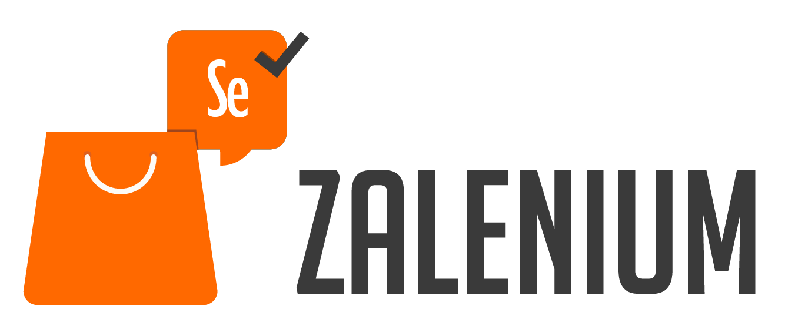
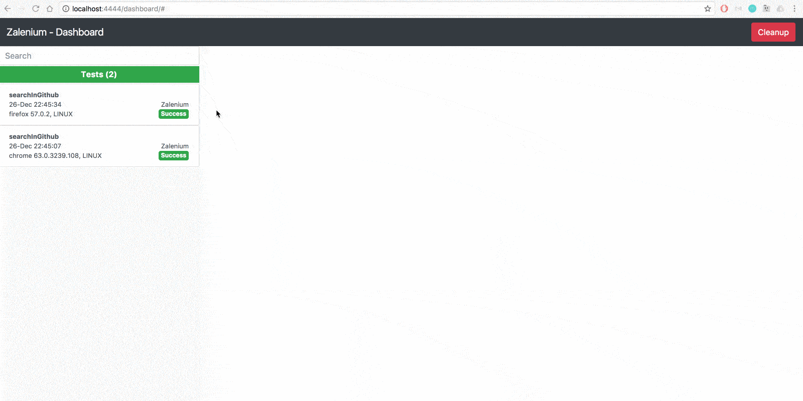
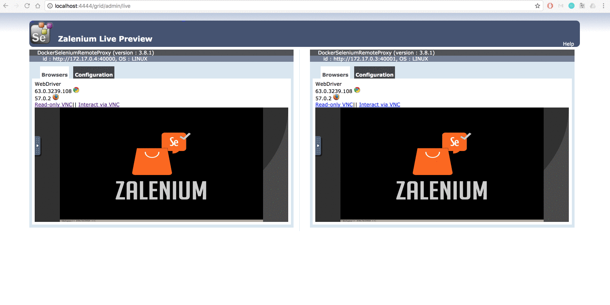

<p align="center">
  

</p>

[](https://travis-ci.org/zalando/zalenium)
[](https://www.codacy.com/app/diemol_zalenium/zalenium?utm_source=github.com&amp;utm_medium=referral&amp;utm_content=zalando/zalenium&amp;utm_campaign=Badge_Grade)
[](https://codecov.io/gh/zalando/zalenium)
[](https://github.com/zalando/zalenium/releases)
[](https://hub.docker.com/r/dosel/zalenium/tags/)
[](https://seleniumhq.herokuapp.com)


This is a Selenium Grid extension to scale your local grid dynamically with docker containers. It uses
[docker-selenium](https://github.com/elgalu/docker-selenium) to run your tests in Firefox and Chrome locally, if you
need a different browser, your tests can get redirected to a cloud testing provider ([Sauce Labs](https://saucelabs.com/), 
[BrowserStack](https://www.browserstack.com/), [TestingBot](https://testingbot.com/)). Zalenium also works out of the box
in [Kubernetes](https://zalando.github.io/zalenium/#kubernetes).

Zalenium's maintainers add new features regularly. We invite you to test it, report bugs, suggest any ideas you may
have, and contribute. See our [contributing guidelines](https://zalando.github.io/zalenium/#contributing) for more details.

### Why?

> Thanks for open sourcing this. Our test suite run time has dropped from more than an hour to six minutes. — [@TKueck](https://twitter.com/Tkueck/status/887425829273088000)

We know how complicated it is to:
* Have a stable grid to run UI tests with Selenium
* Maintain it over time (keep up with new browser, Selenium and drivers versions)
* Provide capabilities to cover all browsers and platforms

That is why we took this approach where [docker-selenium](https://github.com/elgalu/docker-selenium) nodes are
created on demand. Your UI tests in Firefox and Chrome will run faster because they are running on a local grid,
on a node created from scratch and disposed after the test completes.

If you need a capability that cannot be fulfilled by [docker-selenium](https://github.com/elgalu/docker-selenium),
the test gets redirected to a cloud testing provider ([Sauce Labs](https://saucelabs.com/),
[BrowserStack](https://www.browserstack.com/), [TestingBot](https://testingbot.com/)).

Zalenium's main goal is: to allow anyone to have a disposable and flexible Selenium Grid infrastructure.

Part of the idea comes from this [Sauce Labs post](https://saucelabs.com/blog/introducing-the-sauce-plugin-for-selenium-grid).

### What does **Zalenium** mean?
As you can imagine, it is the result of mixing _[Zalando](https://tech.zalando.com)_ and _[Selenium](http://www.seleniumhq.org/)_.
As mentioned before, this project's aim is to provide a simple way to create a grid and contribute to the Selenium community.
Nevertheless, this is _**not**_ an official [Selenium](http://www.seleniumhq.org/) project. We kindly ask you to create
[issues](https://github.com/zalando/zalenium/issues/new) in this repository. If you have questions about how to get
started, please join the #zalenium channel on [Slack](https://seleniumhq.herokuapp.com). 

***

## Contents

* [Getting Started](#getting-started)
  * [Prerequisites](#prerequisites)
  * [Run it](#run-it)
* [Additional features](#additional-features)
* [Documentation](#documentation)

## Getting Started

#### Prerequisites
* Docker engine running, version >= 1.11.1 (probably works with earlier versions, not tested yet).
* Make sure your docker daemon is running (e.g. `docker info` works without errors).

* Pull the [docker-selenium](https://github.com/elgalu/docker-selenium) image. `docker pull elgalu/selenium`

* `docker pull dosel/zalenium`

#### Run it
* Zalenium uses docker to scale on-demand, therefore we need to give it the `docker.sock` full access, this is known as
"Docker alongside docker".

  ```sh
   # Pull docker-selenium
    docker pull elgalu/selenium

    # Pull Zalenium
    docker pull dosel/zalenium
          
    docker run --rm -ti --name zalenium -p 4444:4444 \
      -v /var/run/docker.sock:/var/run/docker.sock \
      -v /tmp/videos:/home/seluser/videos \
      --privileged dosel/zalenium start
  ```

  * Why `--privileged`? We suggest you run Zalenium as `--privileged` to speed up the node registration process by
      increasing the entropy level with [Haveged](http://www.issihosts.com/haveged/). Using `--privileged` is optional
      since it is just meant to improve its performance. For more information, check this
      [tutorial](https://www.digitalocean.com/community/tutorials/how-to-setup-additional-entropy-for-cloud-servers-using-haveged).

* Try also our one line installer and starter for OSX/Linux (it will check for the latest images and ask for missing dependencies.)

  ```sh
    curl -sSL https://raw.githubusercontent.com/dosel/t/i/p | bash -s start
  ```

* More usage examples, parameters, configurations, video usage and one line starters can be seen [here](https://zalando.github.io/zalenium/#usage)
* After the output, you can check the [grid](http://localhost:4444/grid/console) console
* Now you can point your Selenium tests to [http://localhost:4444/wd/hub](http://localhost:4444/wd/hub)
* Stop it: `docker stop zalenium`

## Additional features
* [Dashboard](http://localhost:4444/dashboard), see all the videos and aggregated logs after your tests completed.
  <p align="center">
    
  </p>
* Live preview of your running tests [http://localhost:4444/grid/admin/live](http://localhost:4444/grid/admin/live)
<p align="center">
  
</p>

* Video recording, check them in the `/tmp/videos` folder (or the one you mapped when starting Zalenium)
* Customise video file naming via capabilities, basic auth and [more](https://zalando.github.io/zalenium/#usage)

## Documentation

Check the complete documentation at https://zalando.github.io/zalenium/

License
===================

See [License](LICENSE.md)


Security
===================

See [Security](SECURITY.md)
