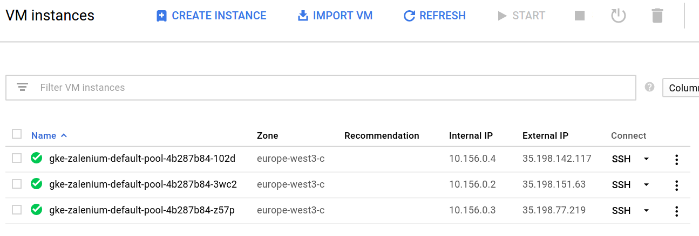

# Zalenium on Google Container Engine (GKE)

This is a step-by-step guide to set up Zalenium on Google Container Engine (GKE).

This is not a general documentation on Zalenium's Kubernetes support, but instead this guide can be used in addition to [that document](https://github.com/zalando/zalenium/blob/master/docs/k8s/kubernetes.md).

## Prerequisites

* You have to have a Google Container Engine account with billing enabled
* And a project created on the [GKE dashboard](https://console.cloud.google.com/kubernetes/)
* The Google Cloud SDK with the `gcloud` tool must be present on your machine and configured to the previously created project
* `kubectl` has to be installed on your machine

Follow the [Quickstart for Google Container Engine](https://cloud.google.com/container-engine/docs/quickstart) to set these up.

## Creating a Kubernetes cluster

```
gcloud container clusters create zalenium
```

```
Creating cluster zalenium...done.
Created [https://container.googleapis.com/v1/projects/xxx/zones/europe-west3-c/clusters/zalenium].
kubeconfig entry generated for zalenium.
NAME      ZONE            MASTER_VERSION  MASTER_IP      MACHINE_TYPE   NODE_VERSION  NUM_NODES  STATUS
zalenium  europe-west3-c  1.6.9           aaa.bb.xxx.yy  n1-standard-1  1.6.9         3          RUNNING
```

Then activate the kubeconfig profile with

```
gcloud container clusters get-credentials zalenium
```

```
Fetching cluster endpoint and auth data.
kubeconfig entry generated for zalenium.
```

Verify the kubectl config with `kubectl get pods --all-namespaces` command.

## Zalenium plumbing

Zalenium uses a Kubernetes ServiceAccount to create pods on-demand. As explained in the [Kubernetes Support](https://github.com/zalando/zalenium/blob/master/docs/k8s/kubernetes.md) article, we have to create the ServiceAccount, and we have to grant the required permissions to that account.

To be able to create the roles and the necessary bindings the GKE setup has a [special step](https://github.com/coreos/prometheus-operator/issues/357), we have to make our users a cluster-admin.

```
kubectl create clusterrolebinding <Arbitrary name for the binding, use your nickname> --clusterrole=cluster-admin --user=<your google cloud login email>
```

Then create the necessary constructs. it also creates a Namespaces, called `zalenium`.

```
kubectl apply -f docs/k8s/gke/plumbing.yaml
```

For the video files, a PersistentVolume has to be created also.

```
kubectl apply -f docs/k8s/gke/pv.yaml
```

Change the kubectl context to "zalenium".

```
kubectl config set-context $(kubectl config current-context) --namespace=zalenium
```

## Launch Zalenium

```
kubectl apply -f docs/k8s/gke/zalenium.yaml
```

Then watch as the pods are created with `kubectl get pods`.

```
➜  yaml git:(kubernetes) ✗ kubectl get pods
NAME                        READY     STATUS    RESTARTS   AGE
zalenium-2238551656-c0w17   1/1       Running   0          4m
zalenium-40000-17d5v        1/1       Running   0          3m
zalenium-40001-xnqdr        1/1       Running   0          3m
```

You can also follow the logs with `kubectl logs -f zalenium-2238551656-c0w17`.

## Accessing Zalenium

#### NodePort

Kubernetes provides [multiple ways](https://kubernetes.io/docs/concepts/services-networking/service/#publishing-services---service-types) to route external traffic to the deployed services. NodePort being the most simple one and by default that is enabled in the docs/k8s/gke/zalenium.yaml file.

NodePort is picking a random port in the default port range (30000-32767) and makes sure that if a request is hitting that port on *any* of the cluster nodes, it gets routed to the deployed pod.

```
$ kubectl get svc
NAME                   CLUSTER-IP      EXTERNAL-IP   PORT(S)           AGE
zalenium               10.43.251.95    <nodes>       4444:30714/TCP    4m
zalenium-40000-058z8   10.43.247.200   <nodes>       50000:30862/TCP   50s
zalenium-40001-853mq   10.43.244.122   <nodes>       50001:30152/TCP   46s
```

The above console output lists all services in the zalenium namespace and you can see that the hub is exposed on port 30714, and the two browser nodes on 30862 and 30152.

To access the service first you have to locate the IP address of one of the cluster nodes. The GKE cluster is built on standard Google Cloud VMs, so to find a node you have to go to the [GCloud dashboard](https://console.cloud.google.com/compute/instances) and copy an IP a node address.



In addition to that, you have to open the GCloud firewall too. To keep the rules flexible, but somewhat tight, the example bellow opens the firewall from a source range of IPs to all of the NodePort variations. Adjust it to your needs.

```
gcloud compute firewall-rules create zalenium --allow tcp:30000-32767 --source-ranges=83.94.yyy.xx/32
```

Zalenium is accessible on the `http://35.198.142.117:30714/grid/console` address in my example.

The dashboard on `http://35.198.142.117:30714/dashboard/` and the "live" page on `http://35.198.142.117:30714/grid/admin/live`


>With NodePort the "live" page works out of the box. With other routing setups it may not work, as Zalenium assumes that the node VNC endoints are available on the same host name as the hub, and they only differ in ports.

## Troubleshooting

In any case you would like to recreate the service the following one liners can assist you:

To delete the PersistentVolume and all Zalenium deployments.
```
kubectl delete -f docs/k8s/gke/pv.yaml && kubectl delete -f docs/k8s/gke/zalenium.yaml
```

Then to recreate them
```
kubectl apply -f docs/k8s/gke/pv.yaml && kubectl apply -f docs/k8s/gke/zalenium.yaml
```